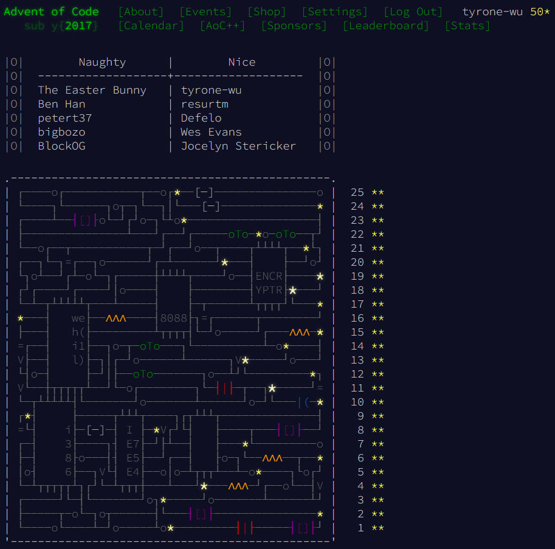

# 🎄 Advent of Code 2017

Your solutions for [Advent of Code](https://adventofcode.com/) written in Java ☕.



## Template setup
### Configure repository
1. Open [the template repository](https://github.com/thermoweb/aoc-java-template) on GitHub
2. Click [Use this template](https://github.com/thermoweb/aoc-java-template/generate) and create your repository
3. Clone your repository on your computer

### Requirements
- Java 17+ installed

## Usage

```shell
Usage: aoc [COMMAND]
run Advent of Code command line tool.
Commands:
  scaffold  create class and tests for the day.
  download  download input file and create an empty example file.
  solve     run the solution with the input for the specified day.
  help      Display help information about the specified command.
```

The usual workflow of this is to:
1. use the `scaffold --day <day>` command to create both test and solution classes in the project for the day.
2. use the `download --day <day>` command to download the input of the day and create an empty example file.
3. write your solution
4. use the `solve --day <day>` command to launch your code with the day's input.

### Scaffold a day
This will create both day class and the associated test.
```shell
# example: `./aoc scaffold --day 1`
./aoc scaffold --day <day>
```

### Download Input for a day

> [!IMPORTANT]
> This requires in your home folder the file `.adventofcode.session` with your session-cookie in it.
> To find it, you have to log in on [adventofcode.com](https://adventofcode.com) and use the web developer tool to retrieve the value of the `session` cookie.

```shell
# example: `./aoc download --day 1`
./aoc download --day <day>
```

this will create the input file and download corresponding data of day and an empty example file.

### Solve a day
```shell
# example: `./aoc solve --day 1`
./aoc solve --day <day>
```
This will launch the day solver for the specified day with the input.

### Help
You can run the help command to see all available commands:
```shell
./aoc help
```

You also can have more information on commands with:
```shell
# example: `./aoc help solve`
./aoc help <command>
```

---

Inspired by [advent-of-code-rust](https://github.com/fspoettel/advent-of-code-rust) template.